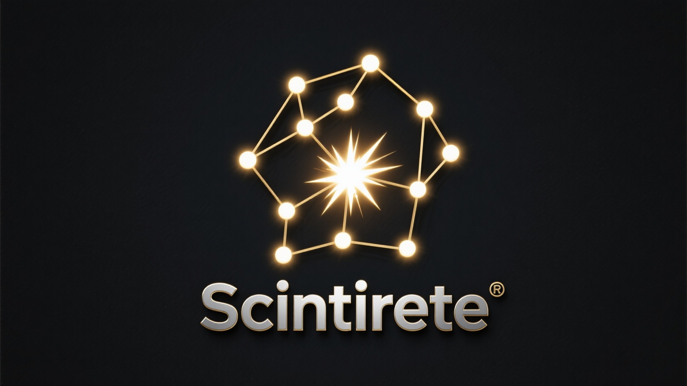

# Scintirete

[](https://github.com/scintirete/scintirete/actions/workflows/ci.yml)
[](https://github.com/scintirete/scintirete/actions/workflows/release.yml)
[](LICENSE)



[中文文档](README_ZH.md)

Scintirete is a lightweight, production-ready vector database built on the HNSW (Hierarchical Navigable Small World) algorithm. The name derives from Latin words "Scintilla" (spark) and "Rete" (network), symbolizing a sparkling network that illuminates the crucial connections within complex data landscapes through deep similarity matching.

**Core Philosophy:** Discover infinite neighbors, illuminate the data network.

## Features

- **Lightweight & Simple**: Self-contained implementation focused on core vector search functionality with minimal dependencies
- **High Performance**: In-memory HNSW graph indexing provides millisecond-level nearest neighbor search
- **Data Safety**: Based on flatbuffers, implements a Redis-like AOF + RDB persistence mechanism to ensure data durability
- **Modern APIs**: Native support for both gRPC and HTTP/JSON interfaces for seamless integration
- **Production Ready**: Structured logging, audit logs, Prometheus metrics, and comprehensive CLI tools designed for production environments
- **Cross-platform**: Support Linux, macOS, Windows, arm64, amd64 architectures out of the box
- **Support Text Embedding**: Support OpenAI-compatible API integration, support automatic text vectorization

Scintirete targets small to medium-scale projects, edge computing scenarios, and developers who need rapid prototyping with a reliable, high-performance, and maintainable vector search solution.

## Quick Start

### Prerequisites

- Go 1.21+ (for building from source)
- Docker (optional, for containerized deployment)

### Installation

#### Option 1: Download Pre-built Binaries

Download the latest release from the [releases page](https://github.com/scintirete/scintirete/releases).

#### Option 2: Build from Source

```bash
git clone https://github.com/scintirete/scintirete.git
cd scintirete
make all
```

#### Option 3: Docker

```bash
docker pull ghcr.io/scintirete/scintirete:latest
```

### Basic Usage

#### 1. Start the Server

```bash
# Using binary
./bin/scintirete-server

# Using Docker
docker run -p 8080:8080 -p 9090:9090 ghcr.io/scintirete/scintirete:latest

# Using docker-compose
docker-compose up -d
```

The server will start with:
- gRPC API on port 9090
- HTTP/JSON API on port 8080

#### 2. Environment Setup with Embedding Support

To use the text embedding features, configure your OpenAI-compatible API, the `[embedding]` section in the configuration file `configs/scintirete.toml` defines the configuration for interacting with the external text embedding service

First create the configuration file from template, then edit it:

```bash
cp configs/scintirete.template.toml configs/scintirete.toml
```

Edit the configuration file `configs/scintirete.toml`:

```toml
[embedding]
base_url = "https://api.openai.com/v1/embeddings"
api_key = ""
rpm_limit = 3500
tpm_limit = 90000
```

#### 3. Basic Operations

Using the CLI tool to perform basic vector operations:

```bash
# Create a database
./bin/scintirete-cli -p "your-password" db create my_app

# Create a collection for documents
./bin/scintirete-cli -p "your-password" collection create my_app documents --metric Cosine

# Insert text with automatic embedding
./bin/scintirete-cli -p "your-password" text insert my_app documents \
  "doc1" \
  "Scintirete is a lightweight vector database optimized for production use." \
  '{"source":"documentation","type":"intro"}'

# Insert more documents
./bin/scintirete-cli -p "your-password" text insert my_app documents \
  "doc2" \
  "HNSW algorithm provides efficient approximate nearest neighbor search." \
  '{"source":"documentation","type":"technical"}'

# Search for similar content
./bin/scintirete-cli -p "your-password" text search my_app documents \
  "What is Scintirete?" \
  5

# Get collection information
./bin/scintirete-cli -p "your-password" collection info my_app documents
```

#### 4. Working with Pre-computed Vectors

If you have pre-computed vectors:

```bash
# Insert vectors directly
./bin/scintirete-cli -p "your-password" vector insert my_app vectors \
  --id "vec1" \
  --vector '[0.1, 0.2, 0.3, 0.4]' \
  --metadata '{"category":"example"}'

# Search with vector
./bin/scintirete-cli -p "your-password" vector search my_app vectors \
  --vector '[0.15, 0.25, 0.35, 0.45]' \
  --top-k 3
```

More documentation can be found in the [docs/](docs/) directory.

## Architecture

Scintirete implements a modern vector database architecture with the following components:

- **Core Engine**: In-memory HNSW graph with configurable parameters
- **Persistence Layer**: Dual-mode persistence with AOF (real-time) and RDB (snapshot) strategies
- **API Layer**: Dual protocol support with gRPC for performance and HTTP/JSON for accessibility
- **Embedding Integration**: OpenAI-compatible API integration for automatic text vectorization
- **Observability**: Comprehensive logging, audit logs, and metrics

For detailed technical documentation, see the [docs/](docs/) directory.

## Configuration

Scintirete uses a single TOML configuration file. The default configuration provides sensible defaults for most use cases:

```toml
[server]
grpc_host = "127.0.0.1"
grpc_port = 9090
http_host = "127.0.0.1"
http_port = 8080
passwords = ["your-strong-password-here"]

[log]
level = "info"
format = "json"
enable_audit_log = true

[persistence]
data_dir = "./data"
aof_sync_strategy = "everysec"

[embedding]
base_url = "https://api.openai.com/v1/embeddings"
api_key = "your-openai-api-key"
rpm_limit = 3500
tpm_limit = 90000
```

## API Documentation

Scintirete provides both gRPC and HTTP/JSON APIs:

- **gRPC**: High-performance interface defined in [protobuf](api/proto/scintirete/v1/scintirete.proto)
- **HTTP/JSON**: RESTful interface accessible at `http://localhost:8080/`

For comprehensive API documentation and usage examples, refer to the [documentation](docs/).

## Performance Considerations

- **Memory Usage**: Vectors are stored in memory for optimal search performance
- **Index Configuration**: Tune HNSW parameters (`m`, `ef_construction`, `ef_search`) based on your accuracy/speed requirements
- **Persistence**: Configure AOF sync strategy based on your durability vs. performance needs
- **Rate Limiting**: Configure embedding API rate limits to prevent quota exhaustion

## Contributing

We welcome contributions to Scintirete! Here's how you can help:

### Development Setup

1. **Fork and Clone**
   ```bash
   git clone https://github.com/your-username/scintirete.git
   cd scintirete
   ```

2. **Install Dependencies and Build**
   ```bash
   brew install flatbuffers protobuf
   make all
   ```

3. **Run Tests**
   ```bash
   make test
   ```

### Contribution Guidelines

- **Code Quality**: Ensure your code passes all tests and follows Go conventions
- **Documentation**: Update documentation for any API or configuration changes
- **Testing**: Add tests for new features and bug fixes
- **Commit Messages**: Use clear, descriptive commit messages
- **Pull Requests**: Provide detailed descriptions of changes and their rationale

### Areas for Contribution

- **Performance Optimization**: HNSW algorithm improvements, memory optimization
- **Features**: Metadata filtering, additional distance metrics, clustering algorithms
- **Integrations**: Client libraries for different languages, framework integrations
- **Documentation**: Tutorials, best practices, deployment guides
- **Testing**: Integration tests, benchmarks, stress tests

### Code of Conduct

We are committed to providing a welcoming and inclusive environment. Please treat all contributors with respect and professionalism.

## License

This project is licensed under the MIT License - see the [LICENSE](LICENSE) file for details.

## Support

- **Documentation**: [Documentation](docs/)
- **Issues**: [GitHub Issues](https://github.com/scintirete/scintirete/issues)
- **Discussions**: [GitHub Discussions](https://github.com/scintirete/scintirete/discussions)

---

*Scintirete: Illuminate the data network, discover infinite neighbors.*
